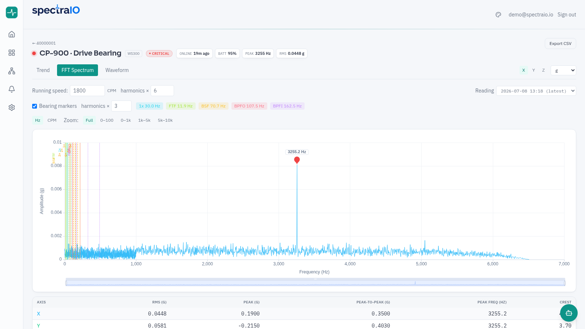
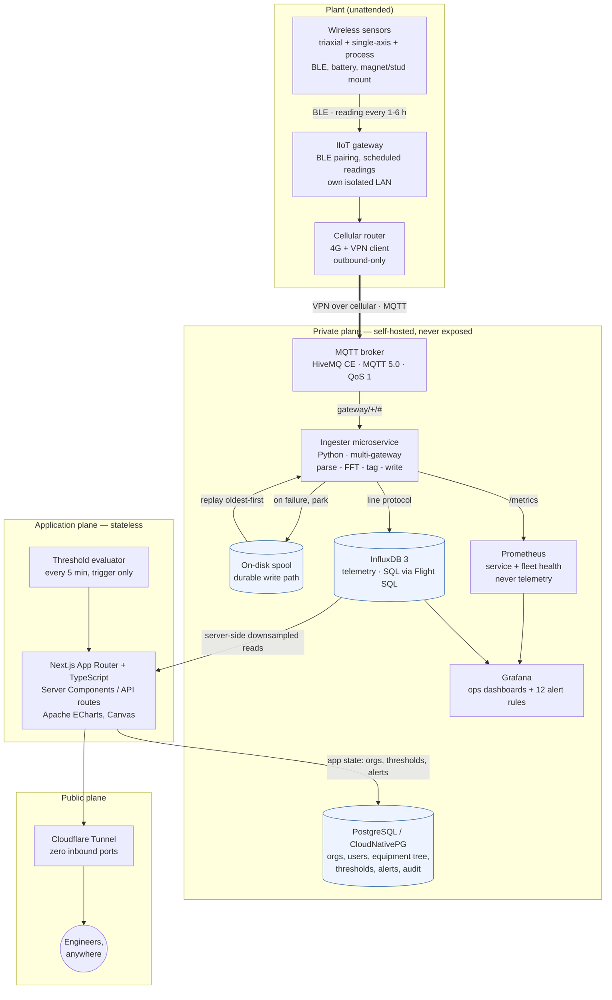
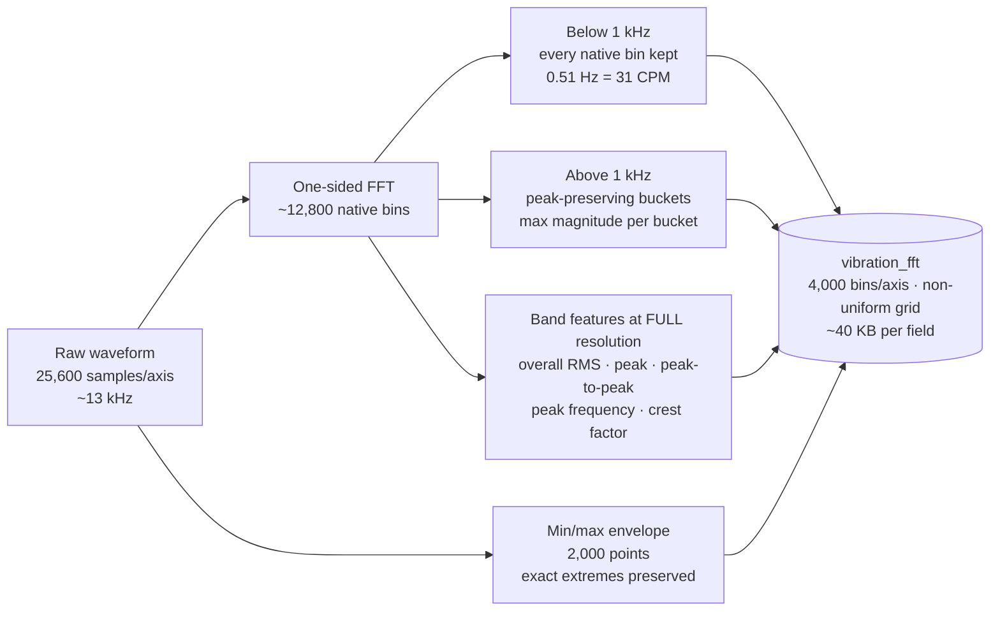
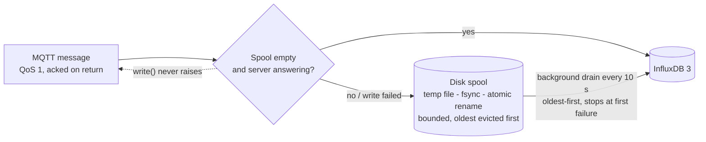
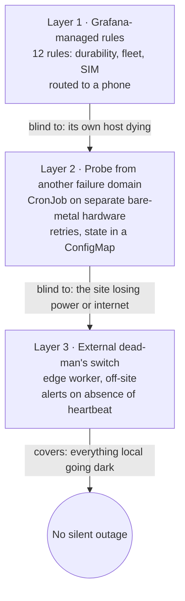
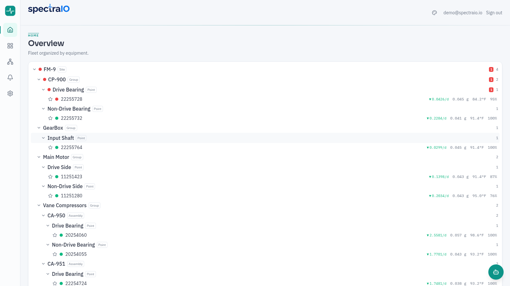
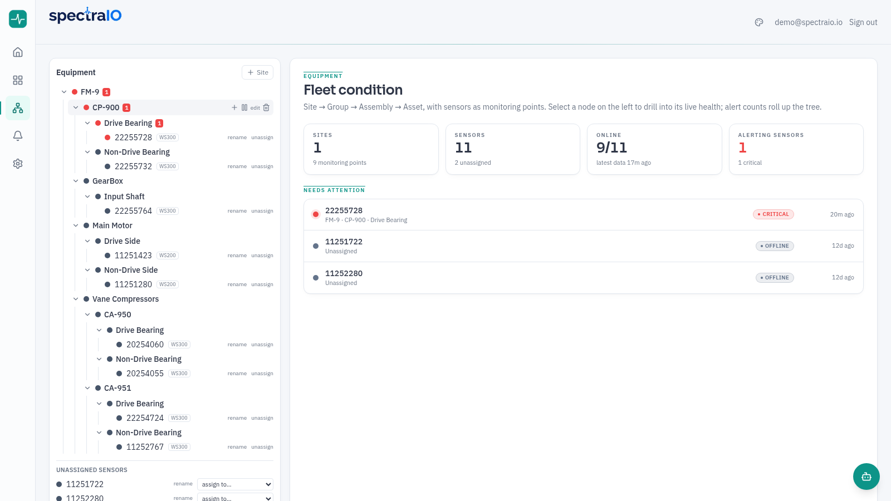
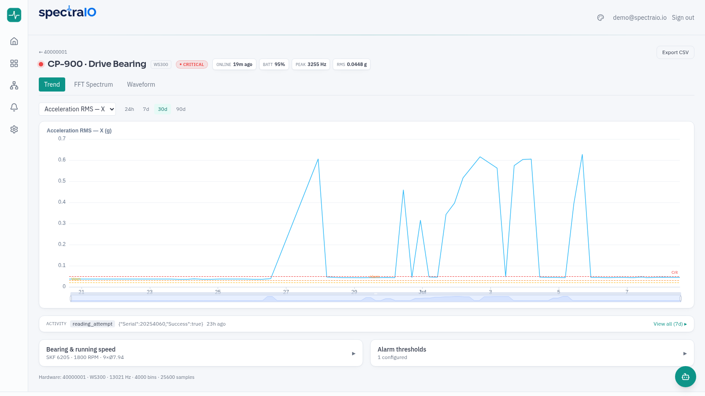
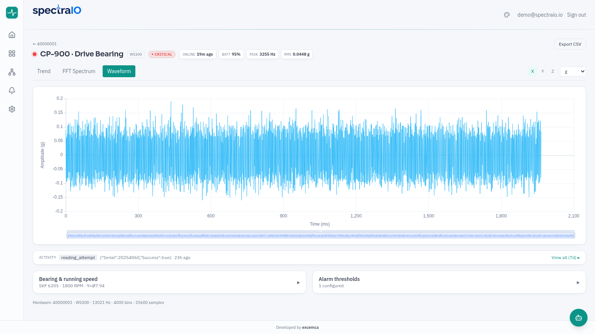
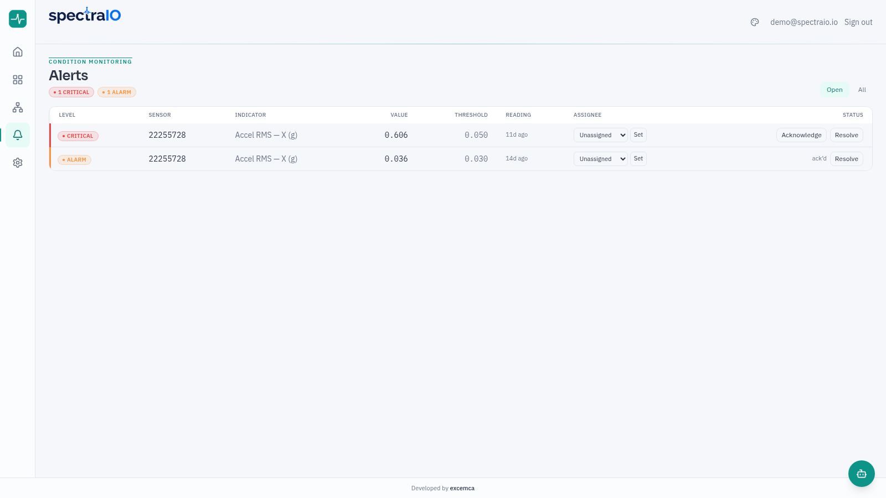

<picture>
  <source media="(prefers-color-scheme: dark)" srcset="assets/spectra-wordmark-dark.png">
  
</picture>

### Industrial Vibration Observability Platform

*Wireless vibration sensors to analyst-grade FFT diagnostics — over a cellular link, in a browser.*

**Running in production** · This is the public engineering write-up. The application source is private — live demo on request.

*FFT spectrum workbench: 4,000 stored bins per axis, bearing fault-frequency markers (BPFO / BPFI / BSF / FTF), harmonic ruler, band zoom, per-axis statistics.*

---

## What this is

SpectraIO is a condition-monitoring platform for rotating equipment: battery-powered wireless
vibration sensors on the machine, an IIoT gateway with its own cellular uplink, and a
self-hosted pipeline that turns every reading into a stored spectrum, a trend, and — when a
threshold is crossed — an alert on somebody's phone.

It runs today on a live fleet at an operating cement plant (crushers, vane compressors,
gearboxes, motors), streaming over 4G, and serves two organizations from one codebase.

This document is the engineering half of the story: **the decisions, the numbers, and the two
outages that shaped the design.** For the commercial overview, see the
[product brief](https://jacedeno.github.io/spectra-io-brief/).

**The constraints that define the whole system:**

| Constraint | Consequence |
| :--- | :--- |
| The link is **cellular**, metered, and shared by the whole site | Every byte is a design decision; a full reading costs ~1 MB, so it must be worth it |
| The plant network is **off limits** | Nothing plugs into it, no ports open inbound anywhere — not at the plant, not at the platform |
| A vibration analyst needs **resolution**, not a pretty chart | ~31 CPM at the frequencies where bearing faults live, with every stored point rendered |
| The site is **unattended** | An outage nobody is notified about is an outage that lasts 19 hours — measured, not hypothetical |

---

## System architecture

Three properties are worth naming, because everything else follows from them:

- **The public plane contains exactly one service.** The web app is reachable through a
  Cloudflare Tunnel; the broker, both databases, the ingester, Prometheus and Grafana are on the
  private plane and stay there. The tunnel is outbound-only, so there is no inbound port to
  forward, at either end of the link.
- **Two stores, on purpose.** Telemetry (high-rate, append-only, never updated) lives in
  InfluxDB 3. Relational state that a human edits — organizations, users and roles, the
  equipment tree, bearing/RPM configuration, thresholds, alert lifecycle, audit trail — lives
  in PostgreSQL. Telemetry is never copied into Postgres, and app state never lands in
  InfluxDB.
- **The app holds no state.** No local database, no filesystem persistence, no session
  affinity — which is what makes the container runtime an implementation detail rather than a
  migration project.

---

## Edge and transport

The sensors speak BLE to a gateway that owns its own isolated LAN. The gateway's uplink is a
cellular router that dials out and holds a VPN tunnel to the platform; MQTT rides inside that
tunnel. Nothing is plugged into the plant's network and no firewall rule is requested, which
is usually the difference between a two-week pilot and a two-quarter IT project.

The gateway publishes JSON under a per-gateway topic namespace, one channel per message class.
The ingester subscribes with a wildcard across gateways and maps every channel it receives:

| Channel class | Stored as | Notes |
| :--- | :--- | :--- |
| Full dynamic reading | `vibration` **+** `vibration_fft` | Scalar summary, plus the computed spectrum, band features and waveform envelope |
| Lite dynamic reading | `vibration` | Compact summary between full readings |
| Process reading | `vibration` (`data_type=process`) | Overall scalars with temperature and battery inline |
| Battery / temperature / check-in / RSSI | `sensor_health` | One row per metric, tagged by `metric` |
| Connect / disconnect / config change | `sensor_config` | Typed columns plus a raw-JSON catch-all |
| Errors, status, gateway up/down, last-will, command responses | `gateway_events` | Tagged by `event_type` |

Every point carries `gateway_sn` and `sensor_id` tags. That single decision is what makes the
platform multi-gateway: **new gateways and sensors are new tag values, never new databases and
never new dashboards.** An earlier design used one database per gateway; it was consolidated
into a single tagged store and the per-gateway databases were deleted.

Two message-level details that cost real debugging time and are easy to get wrong:

- **Multipart reassembly.** Large readings arrive split across several MQTT messages; the
  ingester reassembles them before parsing.
- **Nested payloads.** One channel nests its fields one level deeper than the others. A
  flat-only parser accepted the message, found no fields, and dropped it — silently. Two
  process sensors were invisible for weeks because of it. Structured logging plus a per-channel
  message counter is what surfaced it, not a crash.

---

## The FFT pipeline

This is the part that makes the product a diagnostic tool instead of a trend viewer.

Each dynamic sensor captures **25,600 samples per axis at ~13 kHz** (~6.5 kHz usable
bandwidth). That raw waveform already crosses the cellular link on every full reading, so the
ingester computes the one-sided spectrum from it **at no additional bandwidth cost** — the
alternative, asking the sensor for a spectrum, would pay for the same data twice.

Storing it is where it gets interesting. InfluxDB 3 rejects any single string field over
**64 KB**, and a full-resolution spectrum plus the raw waveform serializes to roughly **977 KB**.
The write fails with a 400 — but only *partially*: the small scalar row still lands, so the
symptom is not "no data", it is "trends fine, spectra mysteriously absent". Worse, the 24-hour
safety net keyed off the missing spectrum and kept re-triggering those sensors hourly, each
retry pulling megabytes over 4G for nothing.

The fix is a **dual-band reduction** rather than a uniform one:

- **Resolution goes where the diagnosis lives.** Bearing fault frequencies and running-speed
  harmonics on 800–1,100 RPM machines sit below a few hundred Hz. Every native bin at or below
  1 kHz is stored untouched — **0.51 Hz, or 31 CPM per bin.** Only the band above 1 kHz is
  bucketed, and with a peak-preserving max rather than an average, so a high-frequency defect
  tone still shows up.
- **The stored frequency grid is deliberately non-uniform.** The app plots `[frequency,
  magnitude]` pairs instead of assuming a constant spacing, which makes the whole scheme
  transparent to the chart.
- **The waveform is stored as a min/max envelope**, oscilloscope-style: 2,000 points that keep
  the visual shape and the *exact* extremes, so the per-axis peak and peak-to-peak table stays
  numerically correct.
- **Band features are computed before any reduction**, at full resolution — the numbers an
  alarm fires on are never the downsampled ones.

An earlier version bucketed the whole spectrum uniformly to 2,000 bins and degraded a reading
from its native 2.06 Hz to ~3.08 Hz per point (185 CPM). Adequate for a trend, useless for
bearing analysis. The dual-band store is **6× finer** in the band that matters and still fits
inside the field limit at ~40 KB.

### The rendering trap

The upgrade shipped and the on-screen resolution was still ~90 CPM. The storage was fine; the
chart library was decimating the series to the canvas pixel width — roughly every third of
4,000 bins — via a "sampling" option that exists precisely to make dense charts fast.

Pixel sampling is now **banned on every diagnostic chart** (spectrum, waveform, trend). Canvas
rendering handles the full 4,000-point series without complaint, and an analyst must see every
point that was stored. It is a one-line option that silently invalidates the product's core
claim, which is exactly the kind of bug that survives a code review.

---

## Bandwidth economics

On a metered cellular link, the data plan is a first-class design constraint:

| Quantity | Value |
| :--- | :--- |
| Full 3-axis reading (25,600 samples/axis) over 4G | **~1.03 MB** |
| Fleet-wide, at the current cadence | ~17 MB/day |
| One dynamic sensor streaming full readings every 6 h | ~62 MB/month ≈ **$1.85/month** at $0.03/MB |
| Check-in / RSSI / battery messages | hundreds of bytes — noise, by comparison |

The ingester counts **payload bytes per sensor and per channel** as a Prometheus counter, so
the fleet's data consumption is a dashboard panel with a monthly projection and a cost
estimate, not a surprise on an invoice. Those panels use the cumulative counter rather than a
rate, because vibration messages are sporadic and large — a series that appears already at its
full value reads as ~0 under `rate()`.

The same dashboard tracks the SIM plan itself against its limit. This is not theoretical: a
SIM hit its data cap, the carrier paused it, and the gateway went dark for 10 hours. There is
now an alert at 80% of the plan and a one-click resume action that only ever touches SIMs in a
paused state.

The next optimization — dropping the waveform from the continuous stream and fetching it on
demand — would take the bill to cents per sensor per month, at the cost of the proactively
stored spectra. It is a deliberate trade, not an oversight: today, every reading yields a
spectrum whether anyone asked for one or not.

---

## Durability: what a 19-hour outage taught

The database crash-looped for **19 hours** and lost the telemetry that arrived during it. The
post-mortem found one cause and two amplifiers, and all three are closed. It is the most
useful thing in this document.

**The cause was a shutdown, not a power cut.** InfluxDB needs ~19 seconds to stop cleanly —
flush the write buffer, checkpoint the catalog, close the WAL. Docker's default stop grace
period is **10 seconds**. So on *any* host shutdown, including a perfectly clean one, the
process is `SIGKILL`ed mid-write and leaves a **zero-byte WAL file** behind. Every stateful
container in the stack now declares an explicit `stop_grace_period`. A grace period is an upper
bound, not a delay — a container that exits in one second still exits in one second — so a
generous value costs nothing.

**Amplifier one: the database could not restart.** Replay skips an empty WAL segment ("file
too small"), but the server then creates the *next* segment with create-if-not-exists
semantics, collides with the empty file already holding that sequence number, and interprets
the collision as another process holding the node — aborting with a message about a node
"still running in another process" that has nothing to do with the real failure. 3,940
restarts, each ~10 seconds, never binding its port. The documented remedy needs a live server
over HTTP, and the process dies before it listens.

The fix is an **entrypoint wrapper**, not an init container: on every start it quarantines
zero-byte WAL files by renaming them out of the replay glob, then `exec`s the real entrypoint
with the original arguments. The distinction matters — on host boot Docker reapplies restart
policies but never honours `depends_on`, so an init service would sit out precisely the
scenario it exists for. It was verified by reproducing the failure on the live system: empty
WAL injected at the next sequence number, container started, file quarantined, server bound in
four seconds with zero restarts.

**Amplifier two: the ingester had nowhere to put readings.** The MQTT client acknowledges a
QoS-1 message as soon as the handler returns, so a reading not persisted at that instant is
gone — the broker will not redeliver it.

Four properties make it correct rather than merely present:

1. **`write()` never raises.** A failed write parks the batch on disk instead of propagating an
   exception into the message handler.
2. **Ordering survives.** While a backlog exists, new batches queue *behind* it, and the drain
   stops at the first failure rather than reordering around a flapping server.
3. **A torn write is impossible.** Batches are written to a temp file, fsynced, then atomically
   renamed — the very failure mode that started the incident is not reproducible in the fix.
4. **The spool is bounded.** Past its cap, the oldest batches are evicted. A long outage costs
   the oldest readings rather than the disk the database lives on; the host was at 86% during
   the incident, and an unbounded buffer would have been a worse failure than the one it
   prevents.

Verified end to end against the running stack: with the database stopped, live sensor traffic
was parked on disk, a drain attempt during the outage replayed nothing and lost nothing, and on
restart the backlog replayed automatically — readings the previous code would have dropped.

---

## Observability, and three layers of alerting

The ingester exposes Prometheus metrics in three groups: **service health** (broker connected,
messages and points, errors, last message per gateway), the **durable write path** (last write
succeeded, batches and bytes on disk, points parked, points replayed, batches dropped — the
last one being real data loss), and **fleet health** (per-sensor last-seen, battery, RSSI),
plus cellular plan metrics polled from the SIM provider's API.

Prometheus scrapes that endpoint — and the database directly, with a bearer token, because a
metric derived from the ingester only moves when a write is *attempted*: during a quiet period
the database can be dead while the gauge still reads healthy. Correct, but it pages nobody.

Everything is keyed by `gateway_sn` and `sensor_id` labels, so a new device appears on the
existing dashboard automatically. There are no per-device dashboards to maintain.

The real lesson of the 19-hour outage was not detection. **An error rule fired the entire
time.** The stack had no alert router configured, so it turned red on a screen nobody was
looking at. Detection without routing is not monitoring.

Each layer exists only to cover the blind spot of the one above it, and the design details are
where the value is:

- **Rules live in exactly one place.** They were *moved* to the alerting layer, not copied —
  two definitions of the same alert drift apart, and only one of them can page anyone.
- **"No data" is a per-rule decision, not a default.** Alert when absence *is* the failure (the
  database is unreachable; the ingester process is gone). Stay silent everywhere else, because
  absence is normal: a counter has no series until it first increments, and per-sensor gauges
  vanish across a restart until each sensor reports again. Left at the default, those rules
  page on every deploy.
- **Two PromQL guards worth stealing.** Dividing usage by a limit alerts forever on devices
  with no configured limit unless you filter `limit > 0`; and `time() - gauge` on a
  never-yet-set gauge is ~56 years, which fires on every restart unless you guard the zero.
- **The layer-2 probe watches one thing.** Adding more services to its decision would duplicate
  layer 1 and page twice for one failure; what layer 1 structurally cannot report is that
  layer 1 is gone. It retries within a single run so one dropped packet is not an outage, and
  it keeps state in a ConfigMap it patches with a narrowly scoped ServiceAccount — otherwise a
  stateless CronJob either notifies on every run, turning a night-long outage into hundreds of
  messages, or never notifies twice.
- **The heartbeat is unconditional.** It asserts one thing: the watchdog ran and reached the
  internet. Tying it to service health would make a single failure page from two layers at
  once and leave silence meaning two different things.

There is one honest blind spot left, and it is architectural: a rule built on in-memory gauges
can only see sensors heard from since the last restart. A sensor that never reports after a
restart has no series and cannot trigger anything. Catching *that* needs an expected-sensor
inventory — which is relational state, and therefore lives in Postgres, not in a metrics store.

---

## The web application

| Decision | Why |
| :--- | :--- |
| **Next.js App Router + TypeScript** | Telemetry is queried in Server Components and API routes only — database credentials never reach a client bundle |
| **SQL over Flight SQL** (`@influxdata/influxdb3-client`) | Standard SQL against a columnar store; no niche query language in the codebase |
| **Server-side downsampling** | Responses capped at ~2,000 points, with a deliberate exception: FFT spectra ship up to 4,000 bins per axis, because that *is* the product |
| **Apache ECharts, Canvas renderer** | Thousands of points per series render smoothly where SVG charting collapses; pixel sampling is banned on diagnostic charts |
| **Auth.js with RBAC, multi-tenant** | Organization scoping and engineer/viewer separation from the first commit, not bolted on |
| **Drizzle ORM + PostgreSQL** | Migrations in version control; the equipment tree, thresholds and alert lifecycle are relational data and are modelled as such |
| **Evaluator as a trigger, not a service** | A 5-minute authenticated call into `/api/cron/evaluate`; all threshold logic runs in-process in the stateless app, so the same code path serves a container runtime or a Kubernetes CronJob |

What an engineer actually does with it: browse a fleet organised as **site → group → assembly →
asset → monitoring point**, drill into a sensor, switch between **trend / spectrum / waveform**,
set the running speed and bearing geometry (from a searchable catalog) to get **1×, BPFO, BPFI,
BSF and FTF markers** drawn on the spectrum, toggle Hz/CPM and zoom bands, read per-axis RMS,
peak, peak-to-peak, peak frequency and crest factor, configure warning/alarm/critical thresholds
per indicator, work the alert lifecycle (acknowledge, assign, resolve — with an audit trail),
and export a trend to CSV. On a phone, the same thing, in a drawer-based shell built for a
plant floor.

Two details that only show up on a real fleet: the available axes are **derived from the data**,
because a single-axis sensor may report on any axis and hard-coding X produces confidently empty
charts; and sensor status is **tri-state** — reporting, paired-but-silent, unpaired — because
collapsing "silent" into "offline" hides the failure that actually matters.

### Multi-tenant and white-label

One codebase serves multiple branded deployments. Branding is centralized in a single module,
sourced from build-time environment variables: name, tagline, logos, accent color (one hex
re-skins all three themes), login hero, footer, assistant name, and the authentication method
(password or passwordless email PIN). Adding a brand needs no code change.

The separation axes are explicit: **source code** shared; **branding**, **auth method**,
**app-state database** and **runtime** per deployment; **telemetry** shared read-only where the
deployments watch the same physical fleet, and split by pointing at a per-customer database
where they do not. Improvements reach every deployment on the next rebuild.

One gotcha worth recording, because it costs an afternoon every time: once a tunnel is wired
for a deployment, the auth library's canonical origin must be updated to the public hostname.
It is a runtime variable, not a build argument, so the tunnel can be perfectly reachable while
every login redirects the user back to an unreachable internal address.

---

## Deployment and runtime

The platform runs today as Docker containers on a single virtualized host: broker, ingester,
time-series database, Prometheus, Grafana, and the branded web instances with their evaluator
triggers. Relational state lives in a **CloudNativePG** cluster on Kubernetes, reached over the
private network — the one component that is already where it will stay.

The production target is **K3s** for the stateless workloads, with manifests for the Postgres
cluster and the evaluator CronJob already in the repository. Two migration notes are worth
being honest about:

- **The spool needs a small PVC**, which pins the ingester to one node and blocks a second
  replica. That is acceptable because the ingester is already single-replica by design — it
  keeps per-sensor state in memory. If it is ever scaled out, the spool has to become a shared
  queue rather than a volume.
- **The WAL guard should become unnecessary, not ported.** It is a workaround for a
  single-node, local-filesystem deployment that lost power mid-write. An object store with
  atomic put semantics cannot leave a zero-byte segment. If the deployment keeps a local
  filesystem on a volume, the guard stays — and a Kubernetes init container is the right shape
  there, unlike Docker, because Kubernetes always runs init containers before the app
  container, including after a node reboot.

Exposure is through a **Cloudflare Tunnel** with no inbound ports at any layer; secrets are
injected as environment variables and Kubernetes secrets, and none of them are in version
control.

---

## Screenshots

Live platform, real fleet, identifiers and accounts anonymized.

| | |
| :---: | :---: |
|  |  |
| **Fleet overview** — live tree with per-sensor readings, trend arrows and severity roll-up | **Equipment hierarchy** — site → group → assembly → asset, sensors as monitoring points |
|  |  |
| **Trend analysis** — 30-day RMS with warning / alarm / critical bands | **Time waveform** — 25,600-sample capture per axis, exact extremes preserved |
|  |  |
| **FFT workbench** — 4,000 bins/axis, bearing markers, harmonic ruler, Hz/CPM | **Alerts** — acknowledge / assign / resolve with an audit trail |

---

## What's next

- **On-demand high-resolution readings** — force a spectrum between scheduled ones from the
  app, which also unlocks dropping the continuous waveform and taking the cellular bill to
  cents per sensor.
- **Long-range radio for dispersed assets** — the same platform ingests standard MQTT, so
  LoRaWAN nodes covering well clusters and pump stations are a new radio, not a new system.
- **Expected-sensor inventory in alerting** — closing the one structural blind spot described
  above by driving fleet-completeness alerts from the relational store.
- **Migration of the stateless workloads to K3s**, and the V1.0 decision on the telemetry sink.

## Stack

`Next.js` · `React` · `TypeScript` · `Apache ECharts (Canvas)` · `Tailwind CSS` ·
`Auth.js` · `Drizzle ORM` · `PostgreSQL / CloudNativePG` · `InfluxDB 3 (SQL over Flight SQL)` ·
`Python` · `HiveMQ (MQTT 5.0)` · `Prometheus` · `Grafana` · `Docker` · `K3s` ·
`Cloudflare Tunnel`

## About

SpectraIO is designed and built by [Jose Cedeno](https://github.com/jacedeno) — Senior
Reliability Engineer and IIoT architect. It grew out of real plant-floor pain: 30+ years around
rotating equipment, now paired with a self-hosted, cloud-native stack.

**Contact:** [LinkedIn](https://www.linkedin.com/in/joseangelcedeno/) · demo on request.
