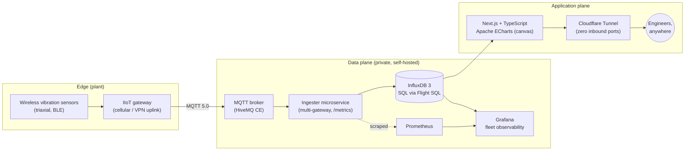

<picture>
  <source media="(prefers-color-scheme: dark)" srcset="assets/spectra-wordmark-dark.png">
  
</picture>

### Industrial Vibration Observability Platform

*From wireless vibration sensors to real-time FFT diagnostics — in the browser.*

**Status: private beta** · This is the public product showcase. The application source is private — live demo available on request.

---

## The problem

Condition monitoring of rotating equipment (mills, fans, pumps, bucket elevators) generates
high-frequency vibration data that most plants either don't capture or can't exploit:
vendor portals lock the data in, generic dashboards choke on spectral payloads, and a
reliability engineer ends up exporting CSVs to analyze an FFT that is hours old.

**SpectraIO** ingests a wireless vibration sensor fleet end-to-end and serves trend and
spectrum analysis to the engineer in seconds — self-hosted, vendor-neutral, and built on
open infrastructure.

## What it does

- **System dashboard** — machine and sensor health at a glance, with alert counts.
- **Trend analysis** — velocity/acceleration/temperature trends per axis, server-side
  downsampled so charts stay fast on any connection.
- **FFT spectrum workbench** — interactive spectral analysis with bearing fault-frequency
  markers, rendered on HTML canvas for high point density.
- **Threshold alerts** — warning / alarm / critical bands per measurement.
- **Issue lifecycle** — create, assign, and close maintenance findings without leaving the app.
- **Role-based access** — engineer vs. viewer separation from day one.
- **White-label ready** — theming and branding are pluggable per deployment.

## Architecture

Only the web app is published — brokers, databases, and ingestion stay on a private network,
exposed to the internet through an outbound-only tunnel.

## Engineering highlights

| Decision | Why |
| :--- | :--- |
| **InfluxDB 3 + SQL (Flight SQL)** | Columnar store handles high-rate spectral data; standard SQL instead of a niche query language. |
| **Server-side downsampling** | Frontend payloads capped (~2,000 points/request) — FFT views stay responsive over cellular links. |
| **Dedicated ingester microservice** | Replaced the original low-code flow with a typed, multi-gateway service exposing Prometheus metrics. |
| **On-demand high-resolution FFT** | Full spectra are pulled when an engineer asks, not streamed continuously — cuts cellular data volume dramatically. |
| **Canvas rendering (ECharts)** | Spectral charts with thousands of bins render smoothly where SVG charting collapses. |
| **Stateless app runtime** | Docker for beta, Kubernetes (K3s) for production — the app scales without sticky state. |

## Stack

`Next.js` · `TypeScript` · `Apache ECharts` · `InfluxDB 3 (Flight SQL)` · `HiveMQ (MQTT 5.0)` ·
`Prometheus + Grafana` · `Docker / K3s` · `Cloudflare Tunnel`

## About

SpectraIO is designed and built by [Jose Cedeno](https://github.com/jacedeno) —
Senior Reliability Engineer & IIoT architect. It grew out of real plant-floor pain:
30+ years around rotating equipment, now paired with a self-hosted cloud-native stack.

**Contact:** [LinkedIn](https://www.linkedin.com/in/joseangelcedeno/) · demo on request.
